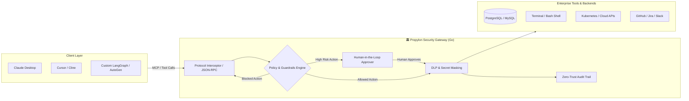

<div align="center">

# 🏛️ Propylon
### The Monumental Security Gateway & WAF for Autonomous AI Agents

[](https://opensource.org/licenses/Apache-2.0)
[](https://golang.org)
[](CONTRIBUTING.md)
[]()

**Don't let autonomous AI agents run wild in production.**  
*An ultra-fast, single-binary security gateway, proxy, and behavioral firewall for Model Context Protocol (MCP) and agentic tool invocations.*

[Quick Start](#-quick-start-in-60-seconds) • [Architecture](#-architecture) • [Key Features](#-key-features) • [Configuration](#-configuration) • [Roadmap](#-roadmap)

---

</div>

## 📖 The Origin: What is *Propylon*?

> In classical Greece, a **Propylon** (*Greek: Προπύλαιον*) was the monumental, fortified gateway structure flanking the entrance to a sanctuary, acropolis, or imperial citadel—most famously, the **Propylaea of the Acropolis of Athens**.
>
> All travelers, merchants, and envoys were required to pass through the Propylon: guards inspected their belongings, verified their credentials, and disarmed all weapons before granting passage into the sacred city.
>
> **Propylon** serves the exact same purpose for the era of Autonomous Agents: standing guard at the threshold between autonomous AI models (Claude, Cursor, AutoGen, CrewAI) and your mission-critical databases, clouds, and enterprise APIs.

---

## 💥 Why Propylon? The Production Dilemma

As developers, we are granting AI agents unprecedented power: bash shells, database access, cloud credentials, and internal APIs. But autonomous models are inherently probabilistic and vulnerable:

1. **Hallucination & Misalignment**: An agent trying to "clean up temporary files" runs `rm -rf /` or deletes active database tables.
2. **Indirect Prompt Injection**: Malicious instructions embedded inside a web page or ticket instruct your agent to exfiltrate database records or AWS secrets.
3. **The Blind Execution Gap**: Enterprises cannot allow agents to execute state-altering operations without human oversight, yet building custom approval workflows into every agent is an architectural nightmare.

**Propylon solves this.** It acts as a transparent reverse-proxy and firewall between any AI Agent and your MCP servers / APIs, giving you total visibility, granular policy enforcement, and interactive human-in-the-loop control.

---

## 🏛️ Architecture



---

## ✨ Key Features

- 🛡️ **Zero-Trust Tool Firewalls**: Inspect tool parameters at the AST and regex level before execution. Block destructive shell commands (`rm -rf`, `mkfs`) and irreversible SQL (`DROP TABLE`, `TRUNCATE`).
- 🚦 **Interactive Human-in-the-Loop (HITL)**: Automatically hold high-risk requests (e.g., financial transactions, production deployments) and request interactive approval in your terminal or via webhooks (Slack/Feishu).
- ⚡ **Blazing Fast & Single-Binary**: Written in Go with zero external runtime dependencies. Sub-millisecond inspection latency; easily deployed via Docker, Kubernetes, or as a standalone CLI.
- 🎭 **Data Loss Prevention (DLP)**: Automatically detect and redact sensitive data (API keys, passwords, PII) in tool outputs before returning them to LLMs.
- 📜 **Tamper-Evident Audit Logging**: Comprehensive telemetry tracking every agent trajectory, tool invocation, argument hash, and outcome for post-mortem analysis and compliance.

---

## 🚀 Quick Start in 60 Seconds

### 1. Build and Run

```bash
# Clone the repository
git clone https://github.com/xrwang8/propylon.git
cd propylon

# Build and start the gateway using the example policy
make run
```

You will see the gateway start up on `http://127.0.0.1:8080`:

```text
  ____                               _               
 |  _ \ _ __ ___  _ __  _   _| | ___  _ __  
 | |_) | '__/ _ \| '_ \| | | | |/ _ \| '_ \ 
 |  __/| | | (_) | |_) | |_| | | (_) | | | |
 |_|   |_|  \___/| .__/ \__, |_|\___/|_| |_|
                 |_|    |___/               
    The Core Security Gateway & Firewall for AI Agents
    Version: 0.1.0-alpha | Greek Origin: Προπύλαιον
------------------------------------------------------------
[Propylon] Gateway listening on http://0.0.0.0:8080 (mode: http)
[Ready] Propylon Gateway is actively guarding AI tool invocations.
```

### 2. Test Dangerous Command Interception

In another terminal, simulate an AI agent attempting a destructive command:

```bash
curl -X POST http://127.0.0.1:8080/v1/mcp \
  -H "Content-Type: application/json" \
  -d '{
    "jsonrpc": "2.0",
    "id": 1,
    "method": "tools/call",
    "params": {
      "name": "execute_command",
      "arguments": {
        "command": "rm -rf / --no-preserve-root"
      }
    }
  }'
```

**Propylon blocks the attempt immediately:**

```json
{
  "jsonrpc": "2.0",
  "id": 1,
  "error": {
    "code": -32001,
    "message": "Blocked by Propylon policy 'block-dangerous-bash': Security Policy Violation: Destructive shell command detected."
  }
}
```

---

## ⚙️ Configuration

Propylon is configured via a single declarative `yaml` file (`configs/propylon.example.yaml`):

```yaml
version: "v1"

server:
  addr: "0.0.0.0:8080"
  mode: "http"

policies:
  # 1. Block destructive commands
  - id: "block-dangerous-bash"
    name: "Block Destructive Shell Commands"
    target_tools: ["execute_command", "shell"]
    action: "block"
    conditions:
      param_matches:
        command:
          - '(?i)rm\s+-rf\s+/'
          - '(?i)mkfs'
    message: "Destructive command blocked by safety policy."

  # 2. Require human approval for production changes
  - id: "require-approval-for-deploy"
    name: "Production Deployment Gate"
    target_tools: ["deploy_service"]
    action: "require_approval"
    approval_channel: "terminal"
    timeout: 30s
    message: "Agent is requesting a production deployment."
```

---

## 🗺️ Roadmap

- [x] **v0.1.0**: Core HTTP JSON-RPC gateway & regex parameter firewall.
- [x] **v0.1.0**: Interactive terminal Human-in-the-Loop approval mechanism.
- [ ] **v0.2.0**: Native `stdio` transport proxying (direct bridge for Claude Desktop).
- [ ] **v0.2.0**: Webhook-based approval channels (Slack, Discord, Feishu, Teams).
- [ ] **v0.3.0**: Open Policy Agent (OPA / Rego) integration for complex enterprise RBAC.
- [ ] **v0.4.0**: eBPF & Linux sandbox container isolation for executed commands.
- [ ] **v0.5.0**: Web Admin Console & visual trajectory inspection dashboard.

---

## 🤝 Contributing

We welcome contributions of all kinds! Whether you are implementing new MCP transports, refining security heuristics, or improving documentation:

1. Fork the repo.
2. Create a feature branch (`git checkout -b feature/amazing-feature`).
3. Commit your changes (`git commit -m 'feat: add amazing feature'`).
4. Push to the branch (`git push origin feature/amazing-feature`).
5. Open a Pull Request.

---

## 📄 License

Propylon is licensed under the [Apache 2.0 License](LICENSE).  
Copyright © 2026 xrwang.
